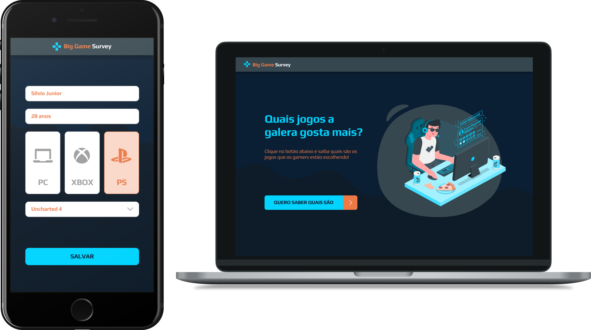

<h1 align="center">
    
     Semana DevSuperior 
   Spring Boot | React | React Native
</h1>

  <a href="#bookmark-sobre">Sobre</a>&nbsp;&nbsp;&nbsp;|&nbsp;&nbsp;&nbsp;
  <a href="#rocket-tecnologias">Tecnologias</a>&nbsp;&nbsp;&nbsp;|&nbsp;&nbsp;&nbsp;

  

## :bookmark: Sobre

O **Big Game Survey** é uma aplicação Web e Mobile feita para realizar pesquisa de preferência de jogos entre as plataformas PC|XBOX|PLAYSTATION, onde será apresentado dentre uma lista de jogos os mais votados e em quais plataformas.
  
Essa aplicação foi realizada durante a semana **DevSuperior**, projeto da [DevSuperior](https://devsuperior.com.br/).

## :rocket: Tecnologias

-  [Typescript](https://www.typescriptlang.org/)
-  [Spring Boot](https://spring.io/projects/spring-boot)
-  [React](https://reactjs.org/)
-  [React Native](http://facebook.github.io/react-native/)
-  [Expo](https://expo.io/)
-  [Axios](https://github.com/axios/axios)

